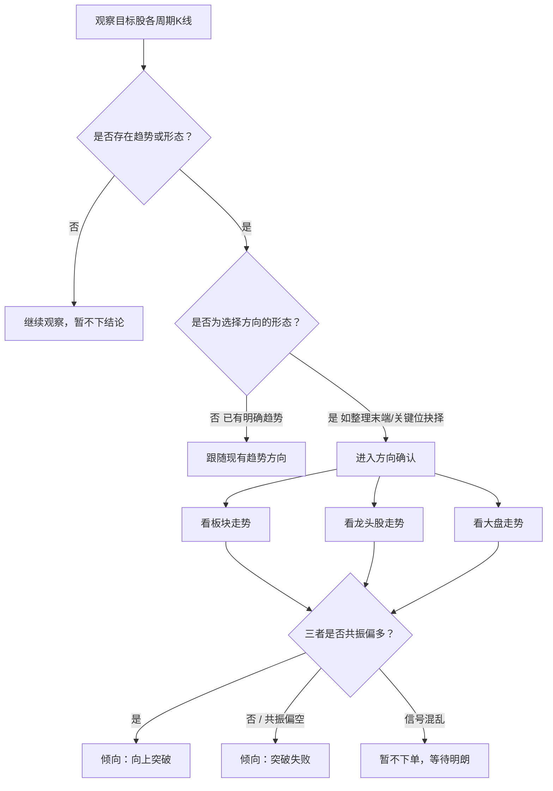

# 多周期形态与突破判断

看股票时先扫各周期 K 线有没有趋势或形态；若是「选择方向」的形态，再结合板块、龙头股、大盘，判断是向上突破还是突破失败。

## 流程图

## 方向确认话术

| 场景 | 提问 / 条件 | 结论 |
|------|-------------|------|
| 形态出现 | 这是选择方向的形态吗？ | 是 → 用板块/龙头/大盘确认 |
| 偏多共振 | 板块强 + 龙头强 + 大盘不拖后腿 | 倾向向上突破 |
| 偏空 / 不配合 | 板块弱 / 龙头弱 / 大盘走坏 | 倾向突破失败 |

## 和 B/S 的衔接

1. 本图先定方向：向上突破 or 突破失败
2. 向上突破 → 进入买入确认（买强的，弱的也止跌上涨）
3. 突破失败 / 强的走弱 → 进入卖出确认
