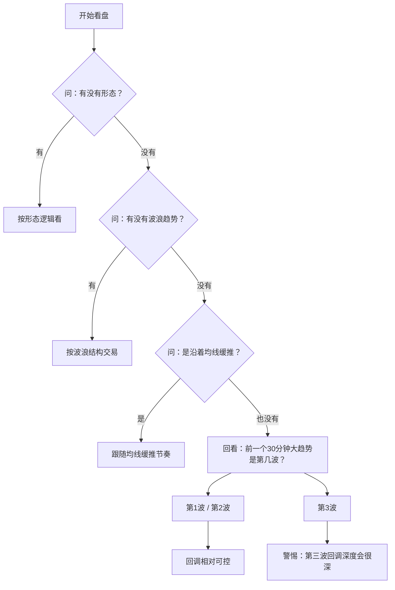

# 看盘自问：形态 / 波浪 / 均线缓推

先问自己：有没有形态？有没有波浪趋势？还是沿着均线缓推？都没有，再看前一个 30 分钟大趋势是第几波——第三波的回调通常会很深。

## 流程图

```mermaid
flowchart TD
    A[开始看盘] --> Q1{问：有没有形态？}
    Q1 -->|有| M[按形态逻辑看]
    Q1 -->|没有| Q2{问：有没有波浪趋势？}

    Q2 -->|有| W[按波浪结构交易]
    Q2 -->|没有| Q3{问：是沿着均线缓推？}

    Q3 -->|是| MA[跟随均线缓推节奏]
    Q3 -->|也没有| Q4[回看：前一个30分钟大趋势是第几波？]

    Q4 --> N1[第1波 / 第2波]
    Q4 --> N3[第3波]

    N1 --> C1[回调相对可控]
    N3 --> C3[警惕：第三波回调深度会很深]
```

## 自问顺序

1. 有没有形态？
2. 有没有波浪趋势？
3. 是不是沿着均线缓推？
4. 都没有 → 前一个 30 分钟大趋势是第几波？
5. 若是第三波：回调深度会很深，别按浅回调去接。
